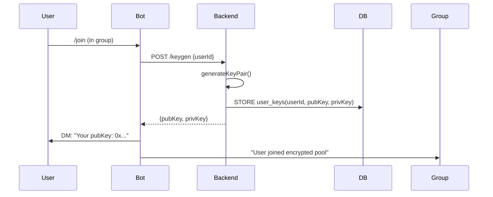
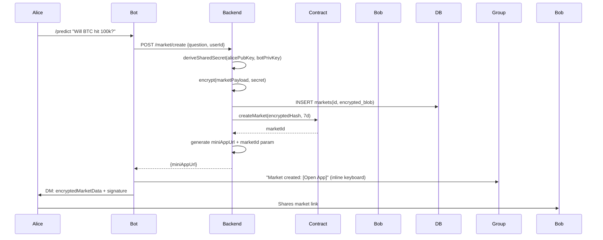
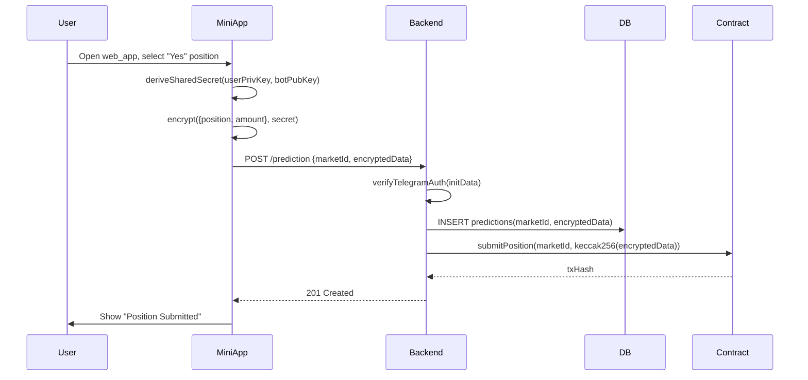
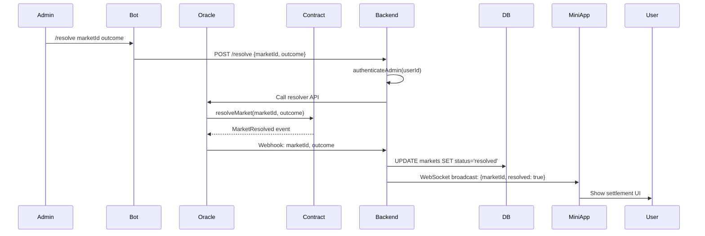

# spec.md

## Encrypted Telegram Prediction Market

**Project:** E2EE prediction market bot + mini app that seeds markets directly from Telegram group chats. All prediction data encrypted client-side; server never sees plaintext.

---

## 1. Architecture

```
┌─────────────────┐        ┌─────────────────┐        ┌─────────────────┐
│   Telegram      │        │  Node Backend   │        │   PostgreSQL    │
│  Client (Bot)   │◄──────►│   + WebSocket   │◄──────►│    (Encrypted   │
│                 │ HTTPS  │                 │   SQL  │      Storage)   │
└─────────┬───────┘        └────────┬────────┘        └─────────────────┘
          │                         │
          │ Web App                 │ JSON-RPC
          │                         │
┌─────────▼───────┐        ┌────────▼────────┐
│  React Mini App │◄──────►│  Smart Contract │
│                 │  ABI   │  (EVM Chain)    │
└─────────────────┘        └─────────────────┘
```

---

## 2. Core Components

### 2.1 Bot (`/bot`)
- Command parser for group chats
- Handles ECDH key exchange via DMs
- Routes encrypted payloads to mini app
- Manages group permissions

### 2.2 Mini App (`/mini-app`)
- React SPA served over HTTPS
- Client-side encryption/decryption only
- Market UI, position management, settlement
- Uses `@twa-dev/sdk`

### 2.3 Backend (`server.js`)
- Stateless API, no decryption capability
- Verifies Telegram `initData` HMAC
- Stores encrypted blobs in DB
- Websocket server for real-time updates

### 2.4 Encryption Module (`/encryption`)
- `generateKeyPair()` → secp256k1
- `deriveSharedSecret(privKey, pubKey)`
- `encrypt(plaintext, secret)` → AES-256-GCM + authTag
- `decrypt(ciphertext, secret)`

### 2.5 Smart Contract (`/contracts`)
```solidity
createMarket(bytes32 encryptedQuestionHash, uint duration)
submitPosition(bytes32 marketId, bytes32 encryptedOutcomeHash)
resolveMarket(bytes32 marketId, bool outcome)
```

---

## 3. Sequence Diagrams

### 3.1 Key Exchange Flow



### 3.2 Market Creation in Group Chat



### 3.3 Making Encrypted Prediction



### 3.4 Market Resolution



---

## 4. API Specification

### 4.1 Endpoints

| Method | Endpoint | Auth | Body | Response |
|--------|----------|------|------|----------|
| `POST` | `/keygen` | Bot token | `{userId}` | `{pubKey, privKey}` |
| `POST` | `/market/create` | Bot token | `{question, userId, groupId}` | `{marketId, miniAppUrl}` |
| `GET` | `/markets/:id` | Telegram initData | - | `{encrypted_blob}` |
| `POST` | `/prediction` | Telegram initData | `{marketId, encryptedData}` | `201 {txHash}` |
| `GET` | `/positions/:userId` | Telegram initData | - | `[{marketId, encryptedData}]` |
| `POST` | `/resolve` | Admin token | `{marketId, outcome}` | `200 {txHash}` |

### 4.2 WebSocket Events

```javascript
// Connect: wss://api.yourapp.com/ws?auth=initData
ws.on('market_update', (data) => {
  // { marketId, encryptedUpdate }
});
```

---

## 5. Security Model

- **Server blind**: All prediction data encrypted client-side. Server stores opaque blobs.
- **Key management**: ECDH shared secrets derived per user-bot pair. Ephemeral keys rotated weekly.
- **Authentication**: All requests verify Telegram HMAC-SHA256 signature.
- **On-chain**: Only encrypted data hashes stored. Settlement via UMA/Chainlink oracle.
- **Rate limiting**: 10 requests/sec per user ID (Redis counter).

---

## 6. Tech Stack

- **Bot**: `node-telegram-bot-api`, Node 20
- **Mini App**: React 18, Vite, `@twa-dev/sdk`
- **Backend**: Express, Helmet, WebSocket `ws`
- **DB**: PostgreSQL with `pg` driver
- **Crypto**: Node `crypto` module (secp256k1, AES-256-GCM)
- **Smart Contract**: Solidity 0.8.24, Hardhat, Ethers v6
- **Deployment**: Vercel (Mini App), Railway (Backend), Sepolia testnet

---

## 7. Deliverables

1. **Working Bot**: Responds to `/predict`, `/join`, `/resolve` in group chats
2. **Mini App**: React UI that decrypts and displays markets, allows encrypted position submission
3. **Backend**: Stateless API + WebSocket server (no decryption logic)
4. **Smart Contract**: Deployed on testnet with create/submit/resolve functions
5. **Encryption Module**: Works in both Node and browser environments
6. **Demo**: 2-minute video showing market creation in group → prediction → resolution

---

## 8. Database Schema

```sql
CREATE TABLE users (
  user_id BIGINT PRIMARY KEY,
  public_key TEXT NOT NULL,
  created_at TIMESTAMP DEFAULT NOW()
);

CREATE TABLE markets (
  market_id TEXT PRIMARY KEY,
  encrypted_data TEXT NOT NULL, -- JSON: {question, creator, ...}_encrypted
  encrypted_hash BYTEA NOT NULL,
  status TEXT DEFAULT 'active',
  created_at TIMESTAMP DEFAULT NOW()
);

CREATE TABLE predictions (
  id SERIAL PRIMARY KEY,
  user_id BIGINT REFERENCES users(user_id),
  market_id TEXT REFERENCES markets(market_id),
  encrypted_data TEXT NOT NULL, -- AES-256-GCM encrypted position
  tx_hash TEXT,
  created_at TIMESTAMP DEFAULT NOW()
);
```

---

## 9. Hackathon Constraints

- **Time**: 48 hours
- **No external infra**: Use Railway free tier, Vercel hobby, Supabase free
- **Testnet only**: Sepolia ETH from PoW faucet
- **No KYC**: Mock compliance layer; note as TODO
- **Scoping**: Single market type (binary), single settlement oracle (manual admin for demo)

---

## 10. Edge Cases

- User joins mid-market: Cannot see past encrypted messages (by design)
- Bot kicked from group: Markets remain, but no new notifications
- Key loss: User must `/join` again; old positions unreadable (feature, not bug)
- Front-running: Admin resolution delayed by 1-hour timelock in contract
